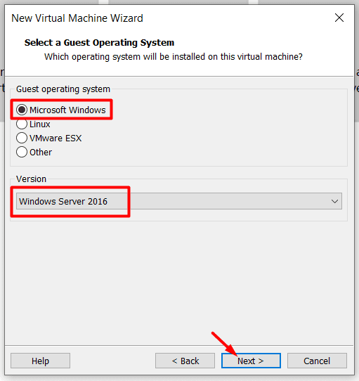
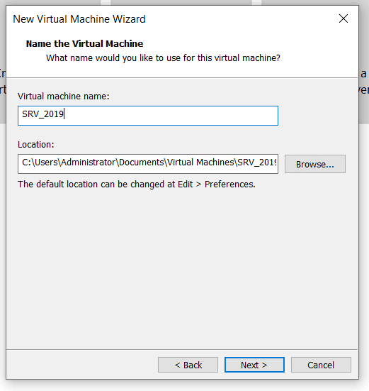
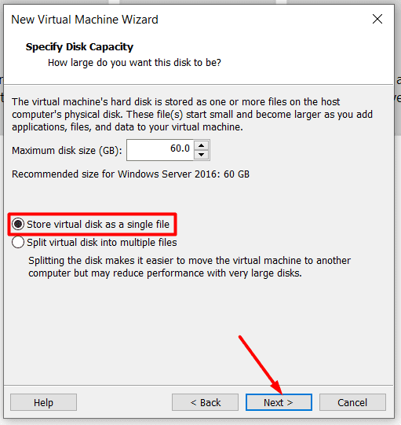
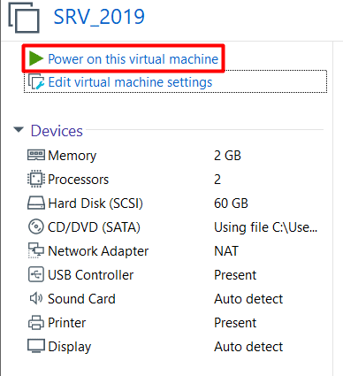

**Chuẩn bị công cụ**

Đầu tiên, chúng ta cần phải chuẩn bị một vài thứ để có thể cài đặt Windows Server 2019 trên VMWare bao gồm:

- Bộ [**ISO Windows Server 2019 Evaluation**](https://www.microsoft.com/en-US/evalcenter/evaluate-windows-server-2019?filetype=ISO)
- [**Công cụ VMWare Workstation PRO**](https://datnt.work/download-vmware-workstation-16-pro/) để ảo hóa phần cứng cài đặt Windows Server 2019

**Cài đặt Windows Server 2019 trên VMWare Workstation**

Sau khi tải về ISO Windows Server và cài đặt VMWare Workstation vào máy tính, chúng ta cùng bắt đầu quá trình cài đặt Windows Server 2019 với việc khởi động VMWare Workstation và chọn **“Create a New Virtual Machine”**

Tiếp đến, nếu bạn là người mới thao tác với VMWare Workstation thì tôi khuyến nghị lựa chọn **Typical** ở cửa sổ tiếp theo

Lựa chọn mục thứ 3 để thêm ISO sau cùng vì nếu như bạn thêm ISO ở bước này, hệ thống sẽ bắt chúng ta khai báo một vài thông tin về tài khoản.

Lựa chọn hệ điều hành cài đặt ở bước tiếp theo, ở đây tôi sẽ chọn **Microsoft** và **Windows Server 2016** (về cơ bản 2016 và 2019 là tương tự nên không lo lắng, do tôi sử dụng version VMWare cũ nên chưa được cập nhật)

Tiếp đến, chúng ta cần đặt tên cho máy ảo Windows Server 2019 để phân biệt với các máy ảo khác và nơi lưu trữ máy ảo

Khai báo thông số dung lượng ổ đĩa trên máy ảo khi tạo ra (mặc định sẽ là **60GB**) và lựa chọn **“Single virtual disk as a single file”**

Ấn **Finish** để hoàn tất

Ở màn hình mới, lựa chọn “**Edit virtual machine settings”** để thêm ISO vào trước khi bật máy ảo

Lựa chọn **CD/DVD (SATA)**, phần Use ISO image file và lựa chọn nơi lưu trữ ISO Windows Server 2019, sau đó ấn **OK** để hoàn tất.

Đến bước này, khởi chạy máy ảo lên bằng việc chọn **Power on this virtual machine**

Hệ thống được khởi động, chọn ngôn ngữ và thời gian và bàn phím sau đó ấn **Next**

Chọn **Install now**

Lựa chọn hệ điều hành muốn cài đặt. Vì ở đây là cài đặt để lab nên tôi sẽ lựa chọn phiên bản cao cấp nhất **(Datacenter Evaluation có giao diện)** và ấn **Next**

đồng thời đồng ý với **các điều khoản của Mcirosoft**

Lựa chọn **Custom: Install Windows only (advanced)**

Tiếp đến lựa chọn phân vùng để bung bộ cài đặt Windows Server 2019, vì ở đây có một ổ đĩa nên tôi sẽ ấn **Next** 

Quá trình cài đặt sẽ tiếp tục diễn ra, tùy thuộc vào cấu hình của máy và ổ đĩa, thời gian sẽ diễn ra khoảng 10 phút.

Sau khi quá trình cài đặt tự động hoàn tất và khởi động lại, bạn sẽ phải khai báo mật khẩu cho tài khoản Administrator ngay trước khi đăng nhập vào hệ điều hành (khác với Windows client sẽ có lựa chọn không cần tạo mật khẩu)

Ấn **Finish** và đăng nhập vào hệ thống, sử dụng **Ctrl + Alt + Del** để unlock. Khi bạn sử dụng VMWare thì tổ hợp phím sẽ là **Ctrl + Alt + Insert**.

Như vậy là chúng ta đã hoàn tất cài đặt Windows Server 2019 trên VMWare để thực hành

